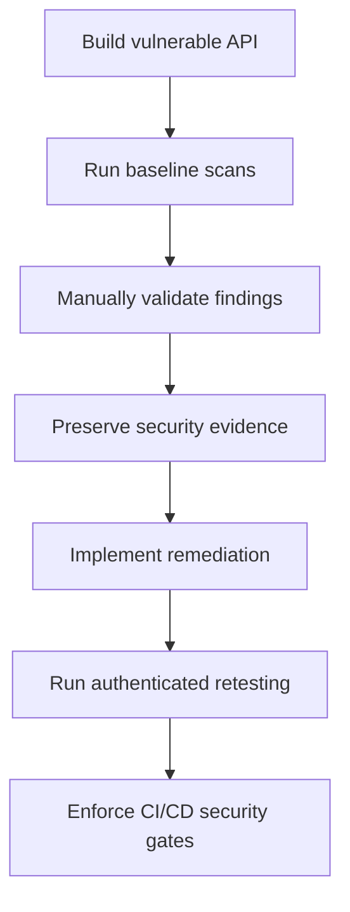

# Secure DevSecOps Pipeline

[](https://github.com/AmrAbd-Elaziz/secure-api-devsecops/actions/workflows/security-pipeline.yml)

A hands-on DevSecOps security project demonstrating the complete lifecycle of identifying, validating, remediating, and retesting security weaknesses in a containerized Flask API.

The project integrates SAST, DAST, SCA, secrets detection, Dockerfile security, container vulnerability scanning, SBOM generation, authentication testing, and automated CI/CD security gates.

> **Repository scope:** This public portfolio contains only the remediated application and its automated security pipeline. The intentionally vulnerable baseline and raw testing evidence are retained separately in a private lab repository.

## Project Objectives

* Build an intentionally vulnerable API for controlled security testing.
* Identify security weaknesses using multiple scanning technologies.
* Manually validate reachability, exploitability, and business impact.
* Preserve baseline evidence before applying remediation.
* Implement secure coding and container hardening controls.
* Retest the remediated application.
* Automate security controls through GitHub Actions.
* Retain machine-readable and human-readable reports as audit evidence.

## Repository Scope

This repository provides a clean portfolio snapshot of the remediated application.

| Repository Component | Availability |
|---|---|
| Remediated application | Included |
| Automated security pipeline | Included |
| OpenAPI specification | Included |
| DAST triage documentation | Included |
| Intentionally vulnerable baseline | Retained separately in a private lab |
| Raw baseline security reports | Retained separately in a private lab |

The vulnerable and remediated versions were originally maintained using linked Git worktrees, allowing simultaneous testing and evidence collection without modifying the original baseline.

## Security Testing Workflow



## Implemented Security Controls

### Application Security

* Parameterized SQL queries to prevent SQL injection.
* JWT-based API authentication.
* Object-level authorization checks.
* Role-aware access control.
* Secure password hashing.
* Generic authentication error responses.
* Removal of the sensitive debug endpoint.
* Production-safe error handling.
* Configurable rate limiting.
* Security response headers.
* Cache prevention for sensitive API responses.

### Secrets Management

* Removed the hardcoded Flask secret key.
* Required sensitive configuration through environment variables.
* Added fail-fast validation when required secrets are missing.
* Masked temporary CI credentials and JWT values in GitHub Actions logs.
* Added custom Gitleaks detection for Flask secret-key assignments.

### Container Security

* Runs the application as a dedicated non-root user.
* Uses a minimal pinned Python base-image tag.
* Includes a container health check.
* Uses Gunicorn instead of the Flask development server.
* Applies controlled file permissions.
* Keeps the runtime database in a writable application data directory.
* Generates a CycloneDX Software Bill of Materials.
* Scans the built image for known vulnerabilities.

### CI/CD Supply-Chain Security

* GitHub Actions are pinned to immutable 40-character commit SHAs.
* Containerized security scanners are pinned to immutable SHA256 digests.
* Workflow permissions are restricted to read-only repository contents.
* Temporary DAST credentials are generated at runtime and masked.
* Security reports are retained as GitHub Actions artifacts.
* Test containers and networks are removed after execution.

## Security Toolchain

| Security Layer     | Tool            | Purpose                                          |
| ------------------ | --------------- | ------------------------------------------------ |
| SAST               | Semgrep         | Static code and workflow security analysis       |
| Secrets Detection  | Gitleaks        | Current-file and Git-history secret detection    |
| SCA                | pip-audit       | Python dependency vulnerability auditing         |
| DAST               | OWASP ZAP       | Authenticated runtime API security testing       |
| IaC / Dockerfile   | Checkov         | Dockerfile configuration and compliance scanning |
| Container Security | Trivy           | Image and filesystem vulnerability scanning      |
| SBOM               | Trivy CycloneDX | Software component inventory generation          |
| CI/CD              | GitHub Actions  | Automated security orchestration and enforcement |

## Vulnerabilities and Remediation

| Security Area    | Vulnerable Baseline                                    | Remediation                                |
| ---------------- | ------------------------------------------------------ | ------------------------------------------ |
| SQL Injection    | User-controlled search value was concatenated into SQL | Parameterized SQLite query                 |
| Secrets          | Flask secret key was hardcoded                         | Required environment variable              |
| Debug Mode       | Flask debug mode enabled                               | Debug disabled and Gunicorn used           |
| Debug Endpoint   | Internal database and secret information exposed       | Endpoint removed                           |
| Authentication   | Sensitive endpoints accessible without authentication  | JWT authentication                         |
| Authorization    | User objects accessible without ownership validation   | Self-access or administrator authorization |
| Password Storage | No secure authentication lifecycle                     | Werkzeug password hashing                  |
| Rate Limiting    | No abuse protection                                    | Global and login-specific rate limits      |
| Security Headers | Important response headers missing                     | Security headers added centrally           |
| Container User   | Application ran as root                                | Dedicated non-root `appuser`               |
| Container Health | No runtime health check                                | Docker `HEALTHCHECK` added                 |
| CI Dependencies  | Mutable Action tags and scanner-image tags             | Immutable SHAs and image digests           |

## Baseline Findings

The vulnerable version produced findings across multiple security layers:

* Semgrep identified four blocking findings, including a hardcoded secret, Flask debug mode, unsafe host exposure, and missing non-root container execution.
* OWASP ZAP identified SQL injection and multiple missing security controls.
* Checkov reported missing non-root execution and missing container health checks.
* Custom Gitleaks detection identified the hardcoded Flask secret key.
* Trivy identified operating-system and Python dependency vulnerabilities.
* CycloneDX SBOM evidence was generated for component visibility.

Raw baseline reports are retained in the private lab repository and are intentionally excluded from this public portfolio. The findings are summarized here without publishing runtime databases, credentials, or unnecessary raw evidence.

## Remediated Results

The remediated application passed the automated GitHub Actions pipeline across four jobs:

* SAST and secrets scanning.
* Dependency security.
* Container and Dockerfile security.
* Authenticated dynamic API security testing.

Successful pipeline evidence:

[View the latest GitHub Actions pipeline runs](https://github.com/AmrAbd-Elaziz/secure-api-devsecops/actions/workflows/security-pipeline.yml)

Authenticated OWASP ZAP results:

| Severity      | Findings |
| ------------- | -------: |
| High          |        0 |
| Medium        |        0 |
| Low           |        0 |
| Informational |        3 |

The informational observations were manually reviewed. They consisted of expected negative-test responses, authentication endpoint identification, and non-storable sensitive content.

See [Authenticated DAST Triage](docs/DAST-TRIAGE.md) for the validation decision.

> Scanner results represent the state of the application, tool versions, and vulnerability databases at scan time. Results may change as detection rules and vulnerability intelligence are updated.

## CI/CD Security Gates

The workflow runs automatically on pushes and pull requests.

```text
Code change
   |
   +-- Semgrep SAST
   +-- Gitleaks secrets detection
   +-- pip-audit dependency audit
   +-- Checkov Dockerfile scan
   +-- Container build
   +-- Trivy vulnerability scan
   +-- CycloneDX SBOM
   +-- Temporary API deployment
   +-- JWT authentication
   +-- Authenticated OWASP ZAP scan
   +-- Evidence upload
```

The pipeline blocks on actionable findings while retaining reports for manual validation and auditability.

## Authenticated DAST Process

The DAST job:

1. Generates temporary credentials during CI.
2. Masks credentials before subsequent steps.
3. Builds the remediated container.
4. Creates an isolated Docker network.
5. Starts the application in an ephemeral environment.
6. Waits for the `/health` endpoint.
7. Authenticates and obtains a temporary JWT.
8. Supplies the authorization header to OWASP ZAP.
9. Scans endpoints from `openapi-remediated.yaml`.
10. Uploads HTML and JSON evidence.
11. Destroys the container and network.

Access logs confirmed authenticated testing:

* `POST /api/login` returned `200`.
* `GET /api/users/1` returned `200`.
* `GET /api/search?q=alice` returned `200`.

## Running the Remediated Application

### Build the Image

```bash
docker build -t secure-api:remediated .
```

### Prepare Local Runtime Values

Enter local test values interactively without writing them to files:

```bash
read -rsp "Local secret key: " SECRET_KEY
echo
read -rsp "Local admin password: " ADMIN_PASSWORD
echo
read -rsp "Local Alice password: " ALICE_PASSWORD
echo
read -rsp "Local Bob password: " BOB_PASSWORD
echo

export SECRET_KEY
export ADMIN_PASSWORD
export ALICE_PASSWORD
export BOB_PASSWORD
```

### Run the Container

```bash
docker run -d \
  --name secure-api-remediated \
  -p 5001:5000 \
  -e SECRET_KEY \
  -e ADMIN_PASSWORD \
  -e ALICE_PASSWORD \
  -e BOB_PASSWORD \
  secure-api:remediated
```

### Health Check

```bash
curl http://127.0.0.1:5001/health
```

Expected response:

```json
{
  "status": "healthy"
}
```

### Authenticate

Create the JSON request from the environment variable without placing a password value in the documentation:

```bash
LOGIN_PAYLOAD=$(python3 -c \
  'import json, os; print(json.dumps({
      "username": "amr",
      "password": os.environ["ADMIN_PASSWORD"]
  }))')
```

Send the authentication request:

```bash
curl -X POST http://127.0.0.1:5001/api/login \
  -H "Content-Type: application/json" \
  --data "$LOGIN_PAYLOAD"
```

Remove sensitive values from the current shell after testing:

```bash
unset LOGIN_PAYLOAD
unset SECRET_KEY ADMIN_PASSWORD ALICE_PASSWORD BOB_PASSWORD
```

Do not commit real credentials, JWTs, databases, or local environment files.

## Repository Structure

```text
.
├── .github/
│   └── workflows/
│       └── security-pipeline.yml
├── docs/
│   └── DAST-TRIAGE.md
├── app.py
├── Dockerfile
├── entrypoint.sh
├── openapi-remediated.yaml
├── requirements.txt
└── README.md
```

## Manual Validation Principle

> Automated scanning is only the starting point. Each finding must be manually validated to determine whether it is reachable, exploitable, and relevant to the application’s business context.

A scanner alert was not automatically treated as a confirmed vulnerability. Findings were reviewed using application behavior, HTTP responses, authorization context, source-code analysis, and before/after retesting.

## Security Disclaimer

This repository is intended for authorized education, defensive security engineering, and portfolio demonstration.

* Do not deploy the vulnerable branch.
* Do not expose the lab directly to the Internet.
* Do not use the testing workflow against systems without explicit authorization.
* Use only temporary local or CI-generated credentials.
* Review all reports before making the repository public.

## Author

**Amr Abdelaziz**
Cybersecurity Engineer — Security Products, Vulnerability Management, Application Security, and DevSecOps

[LinkedIn](https://www.linkedin.com/in/amr-ahmed-abdelaziz94)
